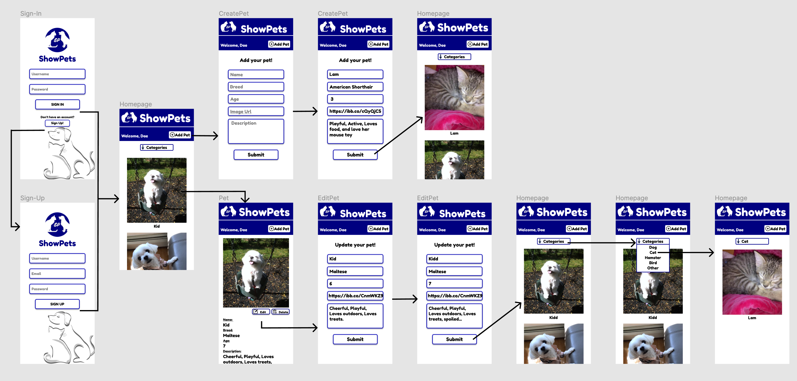
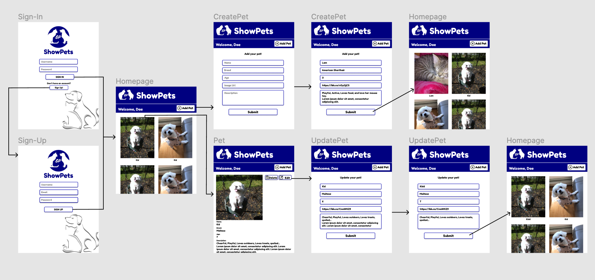
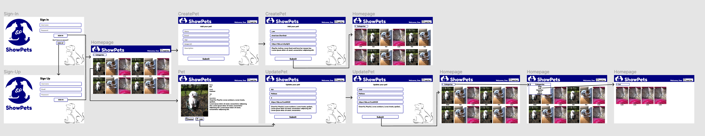
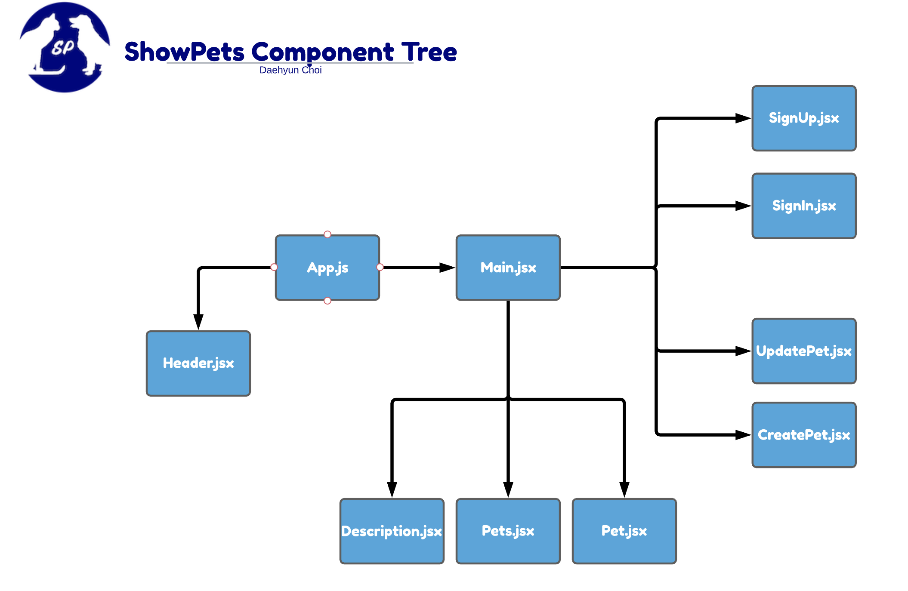
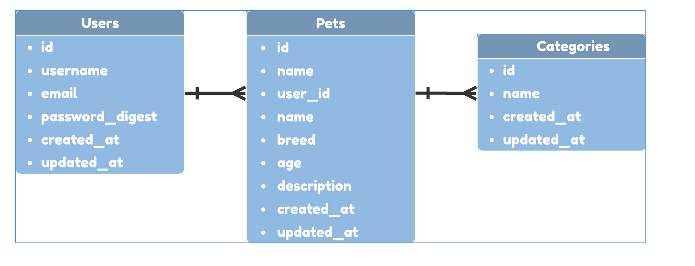

# ShowPets

</img>

- [Overview](#overview)
- [MVP](#mvp)
  - [Goals](#goals)
  - [Libraries](#libraries)
  - [Client (Front End)](#client-front-end)
    - [Wireframes](#wireframes)
    - [Component Tree](#component-tree)
    - [Component Hierarchy](#component-hierarchy)
    - [Component Breakdown](#component-breakdown)
    - [Component Estimates](#component-estimates)
  - [Server (Back End)](#server-back-end)
    - [ERD Model](#erd-model)
- [Post-MVP](#post-mvp)
- [Code Showcase](#code-showcase)
- [Code Issues & Resolutions](#code-issues--resolutions)

<br>

---

## Overview

_**ShowPets** is an application where users will be able to show off their loving pets! Users will be able to add an image along with other information about their pets such as, name, age and a brief description. Users will be able to view all of the pets uploaded, however, they will be able to edit only their own posts._

[🔝](#ShowPets)

---

## MVP

_The **ShowPets** will have an authentication and verification process which allows user to create and maintain their account. ShowPets will also implement full CRUD which allows users to Create, Update and Destroy their own pet posts. As well as the ability to Read (view) other pet posts. The schema for each pet posts will include: image, name, breed, age, and description._

[🔝](#ShowPets)

---

### Goals

- _Successful authentication._
- _Full CRUD._
- _Correct/specific routes._
- _An appropriate design and layout._
- _Properly working end product._

[🔝](#ShowPets)

---

### Libraries

> Use this section to list all supporting libraries and dependencies, and their role in the project.

|     Library      | Description                                                           |
| :--------------: | :-------------------------------------------------------------------- |
|      React       | _Will be used to create the front-end of the application._            |
| React Router Dom | _Will be used to route and link certain components in the front-end._ |
|      Axios       | _Will be used to to call data from the backend._                      |
|       Ruby       | _Can't use rails without Ruby._                                       |
|      Rails       | _Will be used to set up the back-end of the application._             |

[🔝](#ShowPets)

---

### Client (Front End)

#### Wireframes

- Mobile Wireframe

  > https://www.figma.com/file/P7UJCmIUag7RGazooprsqn/ShowPets-Wireframe?node-id=0%3A1 >
  > 

- Tablet Wireframe

  > https://www.figma.com/file/P7UJCmIUag7RGazooprsqn/ShowPets-Wireframe?node-id=3%3A10 >
  > 

- Desktop Wireframe
  > https://www.figma.com/file/P7UJCmIUag7RGazooprsqn/ShowPets-Wireframe?node-id=3%3A11 >
  > 

[🔝](#ShowPets)

---

#### Component Tree

> https://app.lucidchart.com/documents/view/bb89b87d-bcda-41cf-b85e-25081a7c223d/0_0 >
> 

[🔝](#ShowPets)

---

#### Component Hierarchy

```

src
|__ Assets/
      |__ Images
      |__ Structures
      |__ Font
|__ Components/
      |__ Header
            |__ Header.css
            |__ Header.jsx
      |__ Main
            |__ Main.css
            |__ Main.jsx
      |__ Pets
            |__ Pets.css
            |__ Pets.jsx
      |__ Pet
            |__ Pet.css
            |__ Pet.jsx
      |__ Description
            |__ Descriptions.css
            |__ Descriptions.jsx
      |__ CRUD
            |__ CreatePet.jsx
            |__ UpdatePet.jsx
      |__ SignIn
            |__ SignIn.css
            |__ SignIn.jsx
      |__ SignUp
            |__ SignUp.css
            |__ SignUp.jsx
|__ services/
      |__ api-helper.js
      |__ auth.js
      |__ descriptions.js
      |__ pets.js
|__ App.css
|__ App.js


```

[🔝](#ShowPets)

---

#### Component Breakdown

|  Component   |    Type    | state | props | Description                                                                         |
| :----------: | :--------: | :---: | :---: | :---------------------------------------------------------------------------------- |
|    Header    | functional |   n   |   y   | _The header will contain the logo, the title, welcome user, and the create button._ |
|     Main     |   class    |   y   |   y   | _The main will be the source of all states._                                        |
|     Pets     | functional |   n   |   y   | _The Pets will be render the all pets._                                             |
|     Pet      | functional |   n   |   y   | _The Pet will render a single specified pet._                                       |
| Descriptions | functional |   n   |   y   | _The Description will render the information of the specified pet._                 |
|  CreatePet   |   class    |   y   |   y   | _The CreatePet will be used to add a new pet._                                      |
|  UpdatePet   |   class    |   y   |   y   | _The UpdatePet will be used to update specified pet._                               |
|    SignIn    |   class    |   y   |   y   | _The SignIn will allow users to sign in._                                           |
|    SignUp    |   class    |   y   |   y   | _The SignUp will allow users to sign up._                                           |
|     App      |   class    |   y   |   n   | _The App will be the brain of the app and pass props down._                         |

[🔝](#ShowPets)

---

#### Component Estimates

| Task                  | Priority | Estimated Time | Time Invested | Actual Time |
| --------------------- | :------: | :------------: | :-----------: | :---------: |
| Back-End Data         |    H     |     3 hrs      |      hrs      |     hrs     |
| Back-End Routes       |    H     |     3 hrs      |      hrs      |     hrs     |
| Back-End CRUD         |    H     |     3 hrs      |      hrs      |     hrs     |
| Header                |    M     |      1 hr      |      hrs      |     hrs     |
| Sign-In page          |    M     |      1 hr      |      hrs      |     hrs     |
| Sign-In functionality |    H     |     2 hrs      |      hrs      |     hrs     |
| Sign-Up page          |    M     |      1 hr      |      hrs      |     hrs     |
| Sign-Up functionality |    H     |     2 hrs      |      hrs      |     hrs     |
| Api-Helper            |    H     |     2 hrs      |      hrs      |     hrs     |
| Pets                  |    H     |     3 hrs      |      hrs      |     hrs     |
| Pet                   |    H     |     3 hrs      |      hrs      |     hrs     |
| Descriptions          |    M     |     3 hrs      |      hrs      |     hrs     |
| CreatePet             |    H     |     3 hrs      |      hrs      |     hrs     |
| UpdatePet             |    H     |     3 hrs      |      hrs      |     hrs     |
| DeletePet             |    H     |     3 hrs      |      hrs      |     hrs     |
| CSS                   |    H     |     8 hrs      |      hrs      |     hrs     |
| Unexpected Debugging  |    H     |     3 hrs      |      hrs      |     hrs     |
| TOTAL                 |          |     47 hrs     |      hrs      |     hrs     |

[🔝](#ShowPets)

---

### Server (Back End)

#### ERD Model

> https://app.lucidchart.com/documents/view/ffd14497-4e49-4f98-bc22-59e0122a58a8/0_0 >
> 

[🔝](#ShowPets)

---

## Post-MVP

- _The ability for users to comment on other pet posts._
- _The ability for users to like a pet post._

[🔝](#ShowPets)

---

## Code Showcase

> Use this section to include a brief code snippet of functionality that you are proud of and a brief description.

[🔝](#ShowPets)

---

## Code Issues & Resolutions

> Use this section to list of all major issues encountered and their resolution, if you'd like.

[🔝](#ShowPets)
